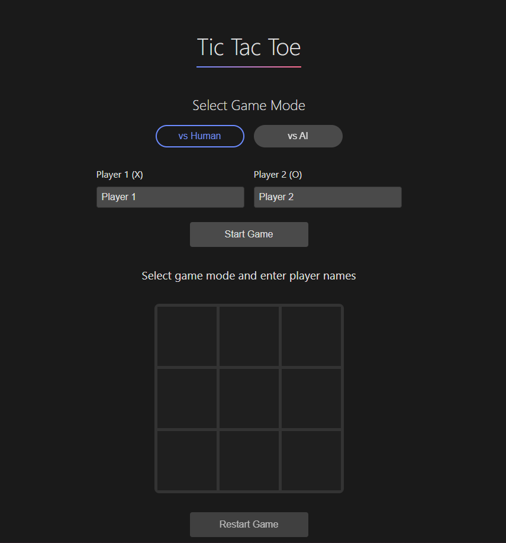

# Modern Tic Tac Toe

A modern, responsive implementation of the classic Tic Tac Toe game with AI opponent and multiplayer support. Built with vanilla JavaScript and features a clean, minimalist design with smooth animations.



## 🎮 Features

- **Two Game Modes**
  - Player vs Player (local multiplayer)
  - Player vs AI

- **Multiple AI Difficulties**
  - Easy: Makes random moves
  - Medium: Mix of random and strategic moves
  - Hard: Mostly strategic with occasional random moves
  - Impossible: Perfect play using Minimax algorithm

- **Modern UI/UX**
  - Clean, minimalist dark theme
  - Smooth animations and transitions
  - Responsive design for all devices
  - Hover effects and visual feedback

- **Technical Features**
  - Modular JavaScript architecture
  - Factory functions and IIFE pattern
  - Minimax algorithm for AI
  - No external dependencies

## 🚀 Live Demo

[Play the game here](https://bit2swaz.github.io/tic-tac-toe)

## 🛠️ Installation

1. Clone the repository:
   ```bash
   git clone https://github.com/bit2swaz/tic-tac-toe.git
   ```

2. Navigate to the project directory:
   ```bash
   cd tic-tac-toe
   ```

3. Open `index.html` in your browser or use a local server:
   ```bash
   # Using Python
   python -m http.server 8000
   
   # Using Node.js
   npx serve
   ```

## 🎯 How to Play

1. Choose game mode (vs Human or vs AI)
2. If playing against AI, select difficulty level
3. Enter player names (or use defaults)
4. Click "Start Game"
5. Players take turns placing their markers (X/O)
6. First to get three in a row wins!

## 🎨 Design Choices

- **Color Scheme**
  - Dark background for reduced eye strain
  - Blue accent for X marker
  - Pink accent for O marker
  - Green highlights for winning combination

- **Responsive Design**
  - Flexible grid system
  - Mobile-first approach
  - Touch-friendly interface
  - Adaptive typography

## 🧠 AI Implementation

The AI uses the Minimax algorithm with different strategies:
- **Easy**: Random moves
- **Medium**: 50% optimal / 50% random
- **Hard**: 80% optimal / 20% random
- **Impossible**: Pure Minimax algorithm

## 🔧 Technical Details

- Vanilla JavaScript (ES6+)
- CSS Grid and Flexbox
- Modular code architecture
- Responsive design with CSS variables
- SVG favicon

## 📱 Browser Support

- Chrome (latest)
- Firefox (latest)
- Safari (latest)
- Edge (latest)
- Mobile browsers

## 🤝 Contributing

Contributions are welcome! Please feel free to submit a Pull Request.

## 📝 License

This project is open source and available under the [MIT License](LICENSE).

## 👨‍💻 Author

Created by [bit2swaz](https://github.com/bit2swaz)

---

Made with ❤️ by bit2swaz